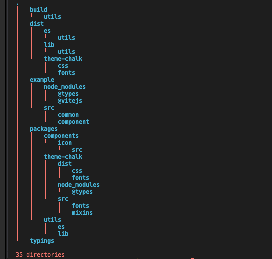
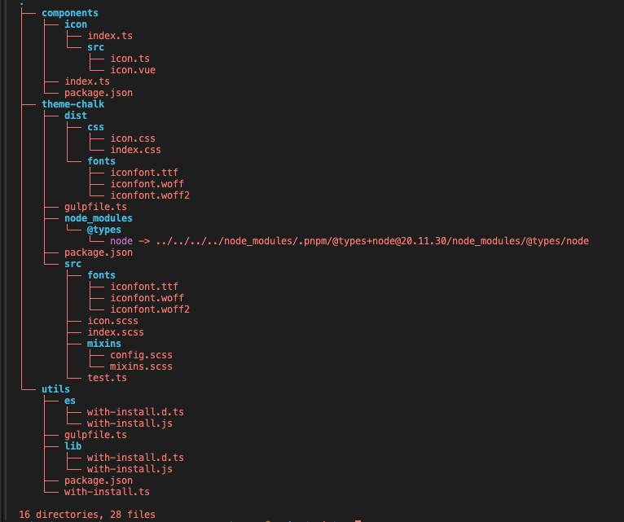

<!--
 * @version:
 * @Author: Hardy
 * @Date: 2024-03-21 16:30:18
 * @Description:
-->
# react-restady
### 目录结构


- dist:负责打包的文件夹，gulp编译ts，打包样式，打包单文件组件
- build:最终生成的打包结果
- packages: 组件代码
- example: 测试组件
- typing: 类型声明
- .npmrc: 增加此文件安装依赖才会正常
- tsconfig: ts配置文件
- pnpm-workspace.yaml: monorepo工作空间

#### packages包目录结构

- components：组件包，最终通过index.ts 导出所有组件
- theme-chalk：样式包，BEM规范，（后续设计规范）
- utils： 工具类，工具方法

### 技术栈
- vue3
- vite
- typescript
- ts-node
- gulp
### 资源
- iconfonts
### 结果
- 持import， require()
- 最终发布dist
### 组件库整合入口
packages/h-plus

### 1、组件开发阶段
```bash
pnpm install vue@latest typescript -D

pnpm install @vue3-component/components -w
pnpm install @vue3-component/theme-chalk -w
pnpm install @vue3-component/utils -w
```
cd example
```bash
pnpm install @vitejs/plugin-vue sass vite @types/node -D
```

### 2、打包阶段
```bash
pnpm install gulp @types/gulp sucrase -w -D
```
#### 2.1打包样式
```bash
pnpm install gulp-sass @types/gulp-sass @types/sass @types/gulp-autoprefixer gulp-autoprefixer @types/gulp-clean-css gulp-clean-css sass -D -w
```

⚠️ 打包之后成了js文件， 那么组件在引入的时候就会失去提示， 那么可以使用[ts-morph包](https://ts-morph.com/emiting)

### 3、统一打包入口阶段（统一入口h-plus）
安装依赖
```bash
pnpm install rollup @rollup/plugin-node-resolve @rollup/plugin-commonjs rollup-plugin-typescript2 rollup-plugin-vue -D -w
```